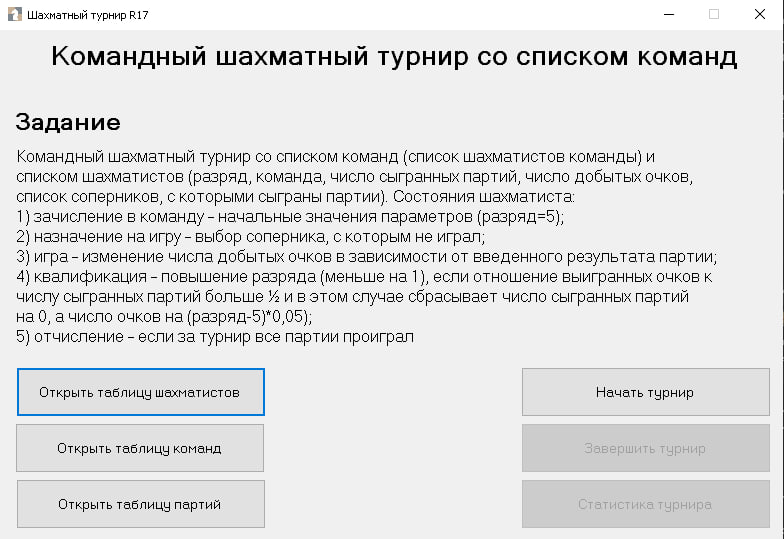
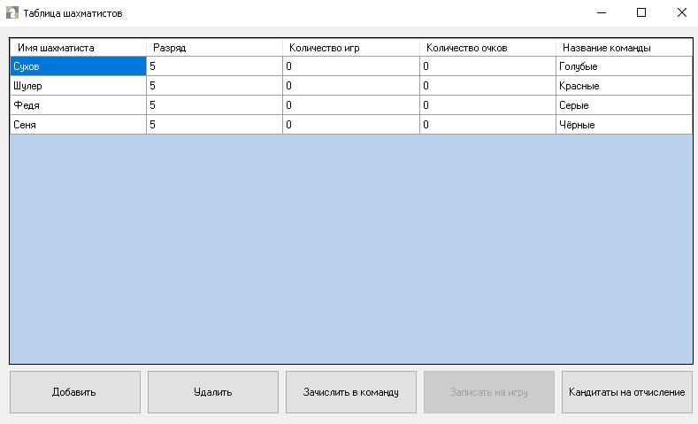
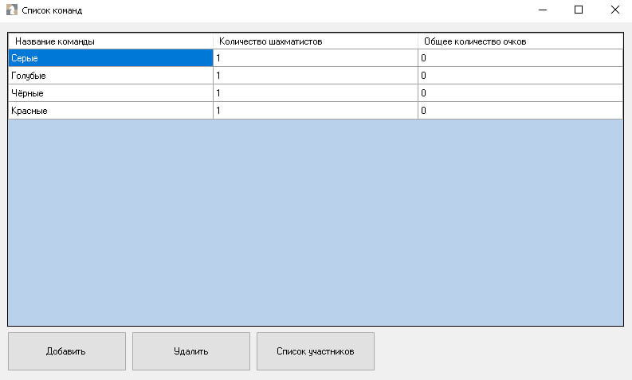
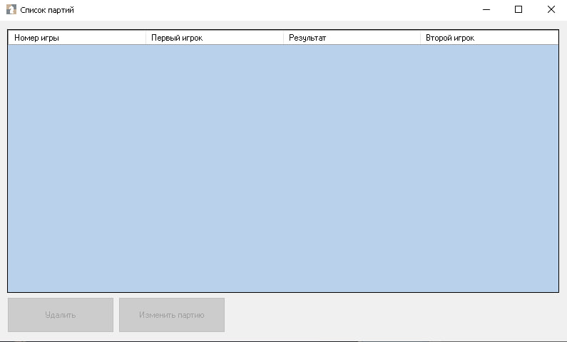

#  Командный шахматный турнир

Приложение для проведения командного шахматного турнира с учётом очков, квалификаций и отчислений.

#  Возможности

- Добавление и удаление шахматистов
- Зачисление в команды
- Просмотр таблиц игроков, команд и партий
- Назначение партий между игроками
- Учёт очков: победа, ничья, поражение
- Квалификация и отчисление по итогам турнира
- Автоматическая статистика: лучшая команда, лучший игрок, номинанты

## 🖼 Интерфейс (пример)

- Начальный экран  
  

- Список игроков
  

- Список команд
  

- Список партий
  

# База данных

- **Шахматист**: ID, имя, разряд, игры, очки, команда  
- **Команда**: ID, название  
- **Партия**: ID, результат, игрок1, игрок2

# Условия турнира
Игроки могут играть только с теми, с кем ещё не играли

После старта турнира нельзя менять имена

Турнир завершается только когда все сыграли друг с другом

# Статистика по завершении
Лучший игрок и команда

Списки на квалификацию и отчисление

Возможность очистить таблицы партий и начать заново
